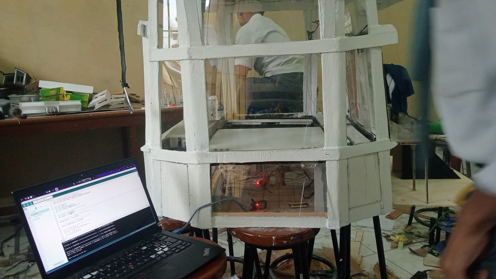

# S.A.G.A — Smart Gathering Automated Area
</br>

</br>

---

## 🌟 Cerita di Balik Proyek

Semuanya berawal dari sebuah perayaan.

Dalam rangka memperingati **HUT Yadika Pamor yang ke-50**, tim kami bertekad untuk membangun sesuatu yang bermakna — bukan sekadar proyek, tapi sebuah visi tentang seperti apa sekolah di masa depan bisa menjadi.

Kami melihat masalah yang sama di mana-mana: institusi pendidikan memiliki **kebutuhan yang beragam**, namun **ruang yang terbatas dan tidak fleksibel**. Aula yang dipakai untuk upacara di pagi hari, bisa menjadi hambatan untuk kegiatan lain di siang harinya. Membangun ruang-ruang khusus yang baru tentu sangat mahal. Hasilnya? Pengalaman belajar yang terkompromikan.

Lalu kami bertanya pada diri sendiri — *bagaimana kalau gedungnya yang beradaptasi?*

Pertanyaan itulah yang menjadi **S.A.G.A** — sebuah aula serbaguna cerdas yang lantai dan panggungnya dapat bergerak dan berubah konfigurasi secara otomatis sesuai kegiatan, semuanya dikendalikan melalui sistem IoT dari genggaman tangan.

Kami tidak memenangkan juara apapun. Tapi jujur? Kami bangga dengan perjalanan itu. Setiap uji coba servo yang gagal, setiap sesi debug larut malam, setiap momen *"ini kenapa nggak jalan sih?!"* — semuanya mengajarkan kami sesuatu. Dan kami tidak akan menukarnya dengan apapun.

---

## 🏛️ Apa Itu S.A.G.A?

**S.A.G.A (Smart Gathering Automated Area)** adalah sistem transformasi aula otomatis berbasis IoT yang dibangun menggunakan **mikrokontroler ESP32**.

Sistem ini memungkinkan **satu gedung memiliki banyak fungsi** — ruang kuliah, tempat upacara, panggung pertunjukan, ruang ujian — dengan cara menggerakkan **lantai dan panggung secara fisik** sesuai kebutuhan kegiatan yang berlangsung.

### Masalah yang Diselesaikan

- 📚 Kegiatan pendidikan sangat beragam, tapi fasilitas tidak mengikuti
- 🏗️ Ruang fisik yang kaku dan tidak fleksibel
- 💸 Biaya pembangunan gedung baru yang sangat tinggi
- ⏱️ Konfigurasi ulang manual yang membuang waktu dan tenaga

### Solusinya

Aula cerdas yang mengkonfigurasi dirinya sendiri — dikendalikan dari jarak jauh, secara instan, dan andal.

---

## ⚙️ Teknologi yang Digunakan

| Komponen | Detail |
|---|---|
| Mikrokontroler | ESP32 |
| Motor Servo | MG995 |
| Bahasa Pemrograman | C++ |
| IDE | Arduino IDE |
| Aplikasi Kontrol | Blynk |

---

## 📱 Cara Penggunaan

SAGA dikendalikan melalui **aplikasi Blynk** di smartphone, yang berkomunikasi dengan ESP32 melalui koneksi Wi-Fi.

### Langkah Memulai

1. **Instal aplikasi Blynk** di perangkat iOS atau Android kamu
2. **Hubungkan ESP32** ke jaringan Wi-Fi lokal
3. **Buka dashboard Blynk** dan gunakan widget yang tersedia untuk mengontrol tata letak aula
4. Pilih **mode kegiatan** yang diinginkan (misalnya: upacara, kelas, pertunjukan)
5. **Motor servo MG995** akan bekerja dan menggerakkan lantai/panggung ke konfigurasi yang sesuai

### Persyaratan

- Arduino IDE (versi terbaru direkomendasikan)
- Paket board ESP32 sudah terpasang di Arduino IDE
- Library Blynk sudah terinstal (cari `Blynk` di Arduino Library Manager)
- Koneksi Wi-Fi yang stabil untuk ESP32

### Upload Firmware

```bash
# 1. Clone repositori ini
git clone https://github.com/repo-kamu/saga.git

# 2. Buka proyek di Arduino IDE
# File > Open > saga.ino

# 3. Isi kredensial kamu di config.h
BLYNK_AUTH_TOKEN = "token_kamu_di_sini"
WIFI_SSID        = "nama_wifi_kamu"
WIFI_PASS        = "password_wifi_kamu"

# 4. Pilih board: ESP32 Dev Module
# 5. Upload ke ESP32 kamu
```
## 👥 Tim Pengembang

Dibangun dengan bangga (dan banyak begadang) oleh:

- **Raissa Adhi**
- **Fauzy**
- **Ferdinan**
- **Daniyall**

*Dibuat untuk merayakan HUT Yadika Pamor yang ke-50.*

---

## 📄 Lisensi

Proyek ini bersifat open source dan tersedia di bawah [Lisensi MIT](LICENSE).

---

<p align="center">
  <i>"we didnt win any trophy but we won something better, with losing we learn"</i><br/>
  <b>— Tim S.A.G.A</b></br>
  <p>im proud of us team, lets be better next time</p>
</p>
